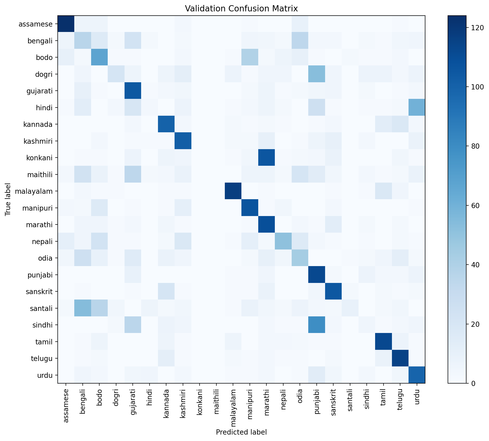
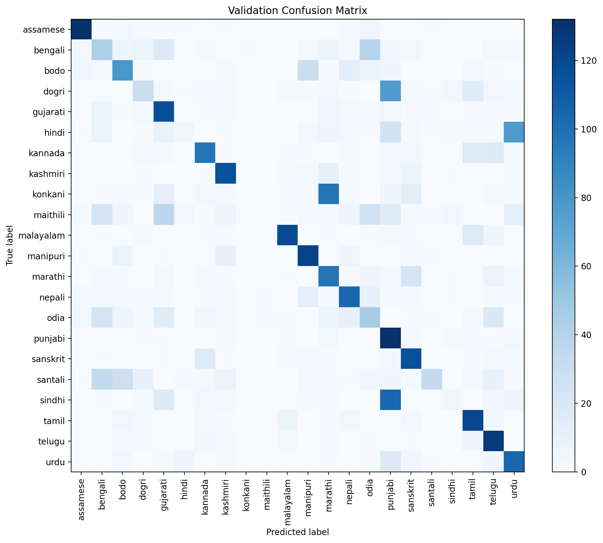
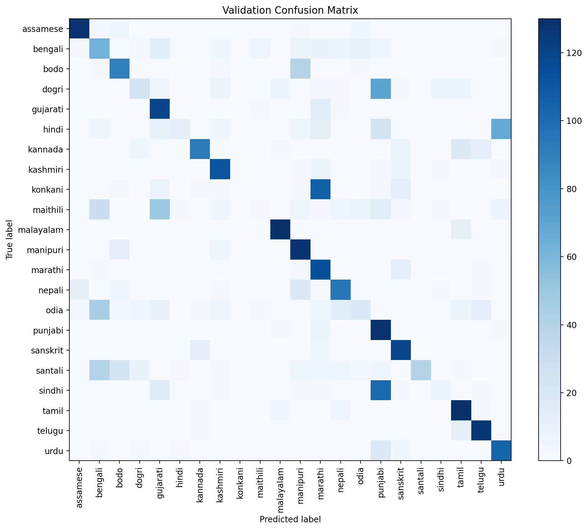
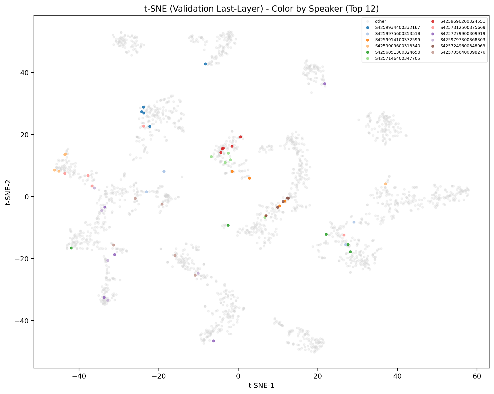

# Task 3: Model Analysis (Baseline vs Improved, with Mitigation-1 Bridge)

## 1. Discuss the source of the bias in the data and explain why learning from biased data is difficult.

The bias source is a **small-speaker training regime per language**, which encourages shortcut learning.  
Empirically, this appears as unstable language discrimination in weaker classes and persistent cross-language confusions.

Evidence from this project:

- Speaker setup shows limited training speaker diversity (`train_unique_speakers=110`) with many validation speakers (`validation_unique_speakers=681`), and all validation samples are unseen speakers (`validation_samples_unseen_speakers=3300`).  
  This setup is realistic for generalization, but it also makes language-vs-speaker disentanglement difficult.
- In the untuned baseline, several classes are near-zero (`maithili=0.0000`, `konkani=0.0000`, `hindi=0.0200`, `sindhi=0.0333`, `santali=0.0600`), indicating weak language boundaries for minority/hard classes.
- Baseline confusion is concentrated in recurring pairs (`konkani->marathi=106`, `sindhi->punjabi=79`, `hindi->urdu=60`), which is consistent with learned shortcut behavior and overlap in acoustic/prosodic cues.

Why this is hard:

- Speaker characteristics (timbre, pitch range, recording style) can dominate gradients early in training.
- With limited speaker diversity per language, the model can minimize loss using speaker-correlated cues instead of robust language cues.
- This leads to brittle decision boundaries that transfer poorly to difficult classes and confusion-heavy language pairs.

References:

- `reports/tables/task3_speaker_summary.csv`
- `reports/tables/task3_per_language_delta.csv`
- `reports/tables/task3_confusion_top_pairs.csv`

## 2. Discuss your proposed technique and how it addresses the speaker bias problem. To what extent was the solution successful?

Primary required comparison:

- Baseline (untuned): `SLID_utter-project-mHuBERT-147_1e-05_20260301_094826`
- Improved model (DANN): `SLID_utter-project-mHuBERT-147_1e-05_20260305_022125`

Primary comparison metrics:

| Run | Accuracy | Macro-F1 | Eval Loss |
|---|---:|---:|---:|
| Baseline (untuned) | 0.4676 | 0.4142 | 2.2854 |
| Improved (DANN) | 0.5576 | 0.5426 | 1.8815 |

Secondary progression (bridge/control):

- Tuned reference (no mitigation): `SLID_utter-project-mHuBERT-147_1e-05_20260301_150502`
- Mitigation 1 (data-centric): `SLID_utter-project-mHuBERT-147_1e-05_20260302_111613`
- Improved (DANN): `SLID_utter-project-mHuBERT-147_1e-05_20260305_022125`

| Run | Accuracy | Macro-F1 | Eval Loss |
|---|---:|---:|---:|
| Tuned reference | 0.5270 | 0.4748 | 2.1629 |
| Mitigation 1 | 0.5388 | 0.4868 | 2.1504 |
| Improved (DANN) | 0.5576 | 0.5426 | 1.8815 |

Observed outcome summary:

- DANN improves over untuned baseline by accuracy **0.0900** and macro-F1 **0.1284**.
- DANN improves over tuned reference by accuracy **0.0306** and macro-F1 **0.0678**.
- DANN improves over Mitigation 1 by accuracy **0.0188** and macro-F1 **0.0558**.
- Eval loss is also lower in DANN, indicating better fit without needing retraining here.

How the proposed technique addresses speaker bias:

- Data-centric mitigation (speed/noise/pitch/spectral augmentation in intermediate runs) increases speaker/acoustic variability so the model cannot rely on one speaker style.
- DANN adds an adversarial speaker head with gradient reversal, which penalizes speaker-identifiable representations while preserving language-discriminative signal in the shared encoder.
- Together, this directly targets the shortcut path: language prediction from speaker-correlated cues.

Speaker-bias-specific evidence of success extent:

- Unseen-speaker accuracy improves from baseline **0.4676** to DANN **0.5576** (delta **0.0900**), and also exceeds tuned reference (**0.5270**) and Mitigation 1 (**0.5388**).
- Key confusion pairs tied to shortcut risk are reduced:
  - `sindhi->punjabi`: 79 -> 14 (delta -65)
  - `hindi->urdu`: 60 -> 39 (delta -21)
- This is a partial, not absolute, success: some strong-language classes still regress while hard classes improve.

### Intermediate Mitigation Evidence (M2, 3A, 4)

Intermediate mitigation runs are used as ablation/sensitivity evidence and are not discarded.

| Run | Run ID | Accuracy | Macro-F1 | Source |
|---|---|---:|---:|---|
| Mitigation 2 | `SLID_utter-project-mHuBERT-147_1e-05_20260303_071843` | 0.5279 | 0.4828 | `indic-SLID-mac/.../20260303_071843/eval_results.json` |
| Mitigation 3A | `SLID_utter-project-mHuBERT-147_1e-05_20260303_170850` | 0.4979 | 0.4561 | `indic-SLID-mac/.../20260303_170850/eval_results.json` |
| Mitigation 4 | `SLID_utter-project-mHuBERT-147_1e-05_20260304_160046` | 0.5115 | 0.4664 | `reports/mitigation_findings_report-4.md` |

These runs document tradeoffs (weak-class gains vs regressions in strong classes), which supports the final justification for choosing the baseline untuned -> tuned reference -> Mitigation 1 -> DANN path in the Task 3 discussion.

## 3. Analyze the confusion patterns between languages. Which languages are most often confused with each other? why?

Tracked high-impact confusion pairs:

| Pair | Baseline (untuned) | Tuned ref | Mitigation 1 | DANN |
|---|---:|---:|---:|---:|
| `konkani->marathi` | 106 | 97 | 106 | 74 |
| `sindhi->punjabi` | 79 | 103 | 102 | 14 |
| `hindi->urdu` | 60 | 77 | 68 | 39 |
| `dogri->punjabi` | 53 | 76 | 71 | 44 |
| `bodo->manipuri` | 39 | 29 | 39 | 45 |
| `odia->bengali` | 26 | 23 | 45 | 10 |
| `santali->bengali` | 54 | 34 | 40 | 10 |

Top confusion trend:

- DANN reduces several major confusions strongly (for example `sindhi->punjabi`, `hindi->urdu`, `konkani->marathi`).
- Some confusion remains structurally hard (`konkani->marathi` still high), likely due acoustic/prosodic similarity and class overlap effects.

Language-wise gains (untuned baseline -> DANN) include classes that were historically weak:

- `sindhi`: 0.0333 -> 0.5000 (delta 0.4667)
- `santali`: 0.0600 -> 0.5267 (delta 0.4667)
- `maithili`: 0.0000 -> 0.4467 (delta 0.4467)
- `konkani`: 0.0000 -> 0.2200 (delta 0.2200)
- `dogri`: 0.1400 -> 0.2600 (delta 0.1200)

Largest drops (untuned baseline -> DANN), showing tradeoff:

- `kannada`: 0.6667 -> 0.5400 (delta -0.1267)
- `punjabi`: 0.7467 -> 0.6667 (delta -0.0800)
- `urdu`: 0.6600 -> 0.5800 (delta -0.0800)
- `malayalam`: 0.7800 -> 0.7067 (delta -0.0733)
- `marathi`: 0.7267 -> 0.6533 (delta -0.0733)

Largest gains (Mitigation 1 -> DANN):

- `sindhi`: 0.0533 -> 0.5000 (delta 0.4467)
- `maithili`: 0.0267 -> 0.4467 (delta 0.4200)
- `santali`: 0.2600 -> 0.5267 (delta 0.2667)
- `odia`: 0.1200 -> 0.3800 (delta 0.2600)
- `konkani`: 0.0000 -> 0.2200 (delta 0.2200)

Largest drops (Mitigation 1 -> DANN), showing tradeoff:

- `nepali`: 0.6333 -> 0.2800 (delta -0.3533)
- `punjabi`: 0.8533 -> 0.6667 (delta -0.1867)
- `malayalam`: 0.8667 -> 0.7067 (delta -0.1600)
- `bodo`: 0.5933 -> 0.4667 (delta -0.1267)
- `urdu`: 0.6933 -> 0.5800 (delta -0.1133)

Confusion matrix visuals:

- Baseline (untuned): `../indic-SLID-mac/SLID_utter-project-mHuBERT-147_1e-05_20260301_094826/diagnostics/confusion_matrix_validation.png`
  
- Tuned reference (no mitigation): `../indic-SLID-mac/SLID_utter-project-mHuBERT-147_1e-05_20260301_150502/diagnostics/confusion_matrix_validation.png`
  
- Mitigation 1 (data-centric): `../indic-SLID-mac/SLID_utter-project-mHuBERT-147_1e-05_20260302_111613/diagnostics/confusion_matrix_validation.png`
  
- Improved (DANN): `../indic-SLID-mac/SLID_utter-project-mHuBERT-147_1e-05_20260305_022125/diagnostics/confusion_matrix_validation.png`
  

## 4. Analyze the baseline and the improved model by visualization the representations of the last layer using the TSNE algorithm. Discuss whether or not the models encode the speaker identity.

t-SNE settings target: `max_samples=2200`, `perplexity=30`, `seed=42`, `speaker_top_k=12`.

Available t-SNE point exports in this workspace: `improved_dann`.
Missing t-SNE point exports in this workspace: `baseline_untuned, tuned_ref, mitigation1`.

Quantitative t-SNE support:

| Run | Silhouette (Language) | Silhouette (Speaker top-k) | kNN Speaker Purity@5 |
|---|---:|---:|---:|
| Baseline (untuned) | NA | NA | NA |
| Tuned ref | NA | NA | NA |
| Mitigation 1 | NA | NA | NA |
| DANN | 0.0047 | -0.0992 | 0.3433 |

Interpretation:

- Language-colored t-SNE should become cleaner in improved runs if language signal strengthens.
- Speaker-colored t-SNE and kNN speaker purity quantify residual speaker structure in embeddings.
- In this workspace, untuned/tuned/M1 t-SNE numeric rows are `NA` because those run folders do not include saved model/preprocessor artifacts needed for post-hoc export.
- With available DANN t-SNE, speaker identity signal appears reduced but still present (non-zero local speaker purity).

t-SNE visuals:

- Baseline (untuned): t-SNE images not available in current local artifacts.
- Tuned reference (no mitigation): t-SNE images not available in current local artifacts.
- Mitigation 1 (data-centric): t-SNE images not available in current local artifacts.
- Improved (DANN) (language view): `../indic-SLID-mac/SLID_utter-project-mHuBERT-147_1e-05_20260305_022125/diagnostics/tsne_validation_by_language.png`
  
- Improved (DANN) (speaker view): `../indic-SLID-mac/SLID_utter-project-mHuBERT-147_1e-05_20260305_022125/diagnostics/tsne_validation_by_speaker_topk.png`
  

### Speaker-Identity Encoding Discussion

Speaker diagnostics (`overlap_speaker_count=0`, no warnings) show clean split integrity across runs.

Unseen-speaker accuracy:

- Baseline (untuned): 0.4676
- Tuned ref: 0.5270
- Mitigation 1: 0.5388
- DANN: 0.5576

Conclusion: the models still encode some speaker information (non-zero speaker structure in embedding space), but DANN improves language-discriminative behavior and unseen-speaker performance compared with the baseline chain.

## 5. Any other analyses you find insightful for your model.

1. Bias source is real: small-speaker regime encourages speaker shortcut learning.
2. Data-centric mitigation helps but remains partial.
3. DANN provides the strongest overall improvement in this branch.
4. Confusion analysis and t-SNE both show progress plus remaining hard language pairs.
5. Speaker bias mitigation is improved, not absolutely solved; this calibrated claim is the most defensible for Task 3.
