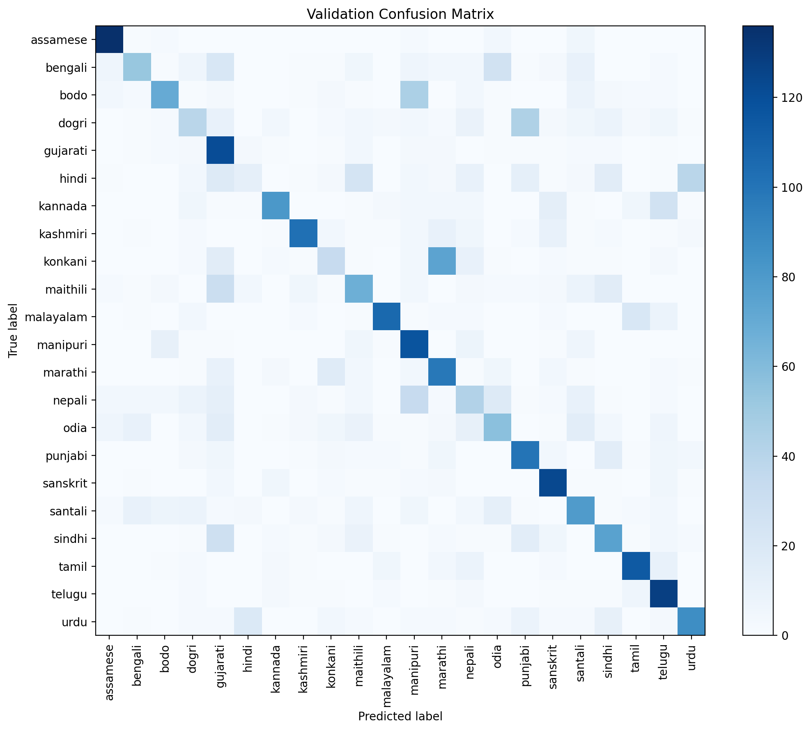
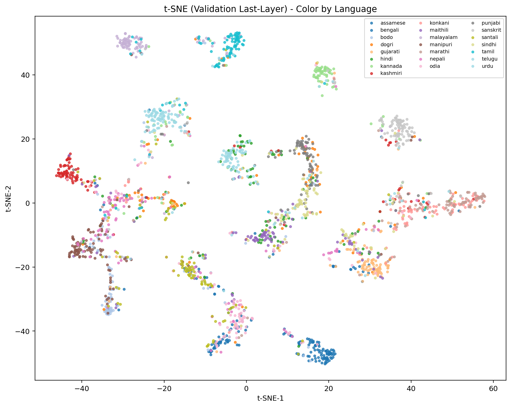

## 1. Overview
This Task 3 analysis is evidence-only and uses artifacts already present in this repository.

Primary evidence sources:
- `indic-SLID-mac/` (run outputs: metrics, confusion matrices, per-language CSVs, speaker diagnostics, and available t-SNE)
- `reports/` (prior comparison/finding reports for run mapping and mitigation context)

Run mapping used in this deliverable:
- Baseline (tuned control): `SLID_utter-project-mHuBERT-147_1e-05_20260301_150502`
- Augmentation mitigation (speed + noise): `SLID_utter-project-mHuBERT-147_1e-05_20260302_111613`
- Improved run (primary): `SLID_utter-project-mHuBERT-147_1e-05_20260305_022125` (DANN)

Global metric summary (validation):

| Run | Eval Accuracy | Eval Macro-F1 | Eval Loss |
|---|---:|---:|---:|
| Baseline | 0.52697 | 0.47481 | 2.16288 |
| Mitigation 1 (speed+noise) | 0.53879 | 0.48676 | 2.15041 |
| Improved (DANN) | 0.55758 | 0.54256 | 1.88149 |

(Full table: `tables/global_metrics_comparison.csv`)

## 2. Source of Bias and Why It Matters
The core bias risk is speaker-identity shortcut learning.

Why this dataset setup is vulnerable:
- Train split has `110` unique speakers (`tables/speaker_summary_baseline.json`).
- The task has `22` languages, so train coverage is roughly `110 / 22 = 5` speakers per language.
- With only around five speakers per language, a model can partially solve language classification by memorizing speaker timbre/prosody cues instead of learning language-specific phonetic structure.

Why biased learning is difficult here:
- If speaker fingerprints correlate with labels, gradient updates reward shortcut features early.
- Shortcut features may improve training/validation metrics quickly, but can fail under speaker distribution shift.
- This makes robust cross-speaker generalization harder, especially for already confusable language pairs.

Evidence from split diagnostics:
- `overlap_speaker_count = 0` and `validation_samples_seen_speakers = 0` for baseline, mitigation1, and improved runs.
- So gains/losses are not due to direct train/validation speaker leakage; they reflect true cross-speaker generalization difficulty.

## 3. What We Did to Reduce Speaker Bias (Baseline vs Mitigation)
Two mitigation directions were used and compared against the tuned baseline.

### 3.1 Data-centric mitigation: speed + noise augmentation
Mitigation 1 (`20260302_111613`) enabled train-only augmentation with speed perturbation and additive noise (per prior run reports and config logs).

Impact vs baseline (`20260301_150502`):
- Accuracy: `0.52697 -> 0.53879` (`+0.01182`)
- Macro-F1: `0.47481 -> 0.48676` (`+0.01195`)
- Loss: `2.16288 -> 2.15041` (`-0.01247`)

Interpretation:
- Mild overall gain, but with class tradeoffs (for example, `odia` dropped by `-0.18667` in per-language accuracy).

### 3.2 Model-centric mitigation: DANN (improved run)
Improved run (`20260305_022125`) enabled DANN (`enable_dann=True`) and produced the strongest overall metrics among the compared runs.

Impact vs baseline:
- Accuracy: `0.52697 -> 0.55758` (`+0.03061`)
- Macro-F1: `0.47481 -> 0.54256` (`+0.06775`)
- Loss: `2.16288 -> 1.88149` (`-0.28139`)

Impact vs augmentation-only mitigation:
- Accuracy: `+0.01879`
- Macro-F1: `+0.05580`
- Loss: `-0.26893`

Interpretation:
- Speed+noise helped, but DANN gave substantially larger net gains in this repo’s available evidence.

## 4. Confusion Pattern Analysis
Confusion matrix visual evidence:

Baseline:


Mitigation 1:


Improved (DANN):


Top-10 confusion table (baseline):

| true_lang | predicted_lang | count | percent_of_true |
|---|---|---:|---:|
| sindhi | punjabi | 103 | 68.67 |
| konkani | marathi | 97 | 64.67 |
| hindi | urdu | 77 | 51.33 |
| dogri | punjabi | 76 | 50.67 |
| bengali | odia | 39 | 26.00 |
| maithili | gujarati | 37 | 24.67 |
| santali | bengali | 34 | 22.67 |
| bodo | manipuri | 29 | 19.33 |
| santali | bodo | 28 | 18.67 |
| maithili | odia | 26 | 17.33 |

Top-10 confusion table (improved/DANN):

| true_lang | predicted_lang | count | percent_of_true |
|---|---|---:|---:|
| konkani | marathi | 74 | 49.33 |
| bodo | manipuri | 45 | 30.00 |
| dogri | punjabi | 44 | 29.33 |
| hindi | urdu | 39 | 26.00 |
| nepali | manipuri | 33 | 22.00 |
| maithili | gujarati | 30 | 20.00 |
| sindhi | gujarati | 28 | 18.67 |
| bengali | odia | 26 | 17.33 |
| kannada | telugu | 26 | 17.33 |
| hindi | maithili | 24 | 16.00 |

Selected pairwise shifts (count):

| Pair | Baseline | Mitigation1 | Improved | Improved - Baseline |
|---|---:|---:|---:|---:|
| sindhi -> punjabi | 103 | 102 | 14 | -89 |
| konkani -> marathi | 97 | 106 | 74 | -23 |
| hindi -> urdu | 77 | 68 | 39 | -38 |
| dogri -> punjabi | 76 | 71 | 44 | -32 |
| odia -> bengali | 23 | 45 | 10 | -13 |
| santali -> bengali | 34 | 40 | 10 | -24 |
| bodo -> manipuri | 29 | 39 | 45 | +16 |

Interpretation:
- Several historically dominant confusions dropped strongly in the improved run.
- Some confusion pressure shifted to other pairs (e.g., `bodo -> manipuri`).

(Full top-10 CSVs: `tables/top10_confusions_baseline.csv`, `tables/top10_confusions_mitigation1.csv`, `tables/top10_confusions_improved.csv`)

## 5. Representation Analysis with t-SNE
Required baseline-vs-improved t-SNE status:
- Baseline t-SNE by language: unavailable
- Baseline t-SNE by speaker: unavailable
- Improved t-SNE by language: available
- Improved t-SNE by speaker: available

Reason baseline t-SNE is unavailable:
- `tables/missing_required_artifacts.csv` shows baseline t-SNE files are missing.
- Baseline run has checkpoint directories but no model weight files (`pytorch_model.bin` / `model.safetensors`) in this repo, so t-SNE could not be regenerated without retraining (explicitly out of scope here).

Improved run t-SNE (DANN):

By language:


By speaker (top-K speakers):


Interpretation from available t-SNE evidence:
- Language coloring shows partial language structure, but not perfectly separated clusters.
- Speaker coloring still shows local speaker grouping in some regions, meaning speaker information remains encoded in last-layer representations.
- Therefore, mitigation appears improved but not complete; embeddings are not speaker-invariant yet.

## 6. Additional Insights
### 6.1 Per-language performance tradeoffs
Largest improved-vs-baseline gains:

| Language | Baseline | Improved | Delta |
|---|---:|---:|---:|
| sindhi | 0.03333 | 0.50000 | +0.46667 |
| maithili | 0.00000 | 0.44667 | +0.44667 |
| santali | 0.22000 | 0.52667 | +0.30667 |
| konkani | 0.00000 | 0.22000 | +0.22000 |
| odia | 0.30667 | 0.38000 | +0.07333 |

Largest improved-vs-baseline drops:

| Language | Baseline | Improved | Delta |
|---|---:|---:|---:|
| nepali | 0.69333 | 0.28000 | -0.41333 |
| punjabi | 0.88000 | 0.66667 | -0.21333 |
| urdu | 0.69333 | 0.58000 | -0.11333 |
| kannada | 0.64667 | 0.54000 | -0.10667 |
| kashmiri | 0.76667 | 0.68000 | -0.08667 |

(Full per-language comparison: `tables/per_language_accuracy_comparison.csv`)

### 6.2 Macro-F1 availability and interpretation
Macro-F1 is available for all compared runs (`tables/global_metrics_comparison.csv`):
- Baseline: `0.47481`
- Mitigation1: `0.48676`
- Improved: `0.54256`

Given heavy class imbalance in difficulty (many weak classes), macro-F1 is informative here and confirms stronger class-balanced performance for improved run.

### 6.3 Speaker overlap and speaker-level robustness evidence
Speaker overlap summary (`tables/speaker_summary_comparison.csv`):
- All runs have `overlap_speaker_count = 0`.
- All validation samples are unseen-speaker samples (`3300/3300`).
- Unseen-speaker accuracy improves monotonically: `0.52697 -> 0.53879 -> 0.55758`.

Speaker-level distribution shift:
- Zero-accuracy validation speakers dropped from `167` (baseline) to `96` (improved).
- Speakers with accuracy `<= 0.2` dropped from `230` to `189`.

This is consistent with reduced speaker-shortcut failure modes on harder speakers.

## 7. Summary of Findings
1. The dataset setup has a clear speaker-shortcut risk (about five train speakers per language).
2. Train-only speed+noise augmentation produced modest global gains but mixed class tradeoffs.
3. DANN delivered the strongest net improvement on global metrics and several historically weak language groups.
4. Confusion structure improved on major pairs (`sindhi->punjabi`, `hindi->urdu`, `dogri->punjabi`) but not uniformly; some tradeoffs remain.
5. t-SNE analysis is partially complete with available evidence: improved run plots are available, baseline plots are unavailable due to missing model weights/checkpoints in this repo.

## 8. Reproducibility (How to Regenerate Figures)
From repo root, run:

```bash
python3 scripts/task3_generate_artifacts.py
```

This command:
- inventories required artifacts for baseline/mitigation1/improved runs,
- copies reusable artifacts into `reports/figures` and `reports/tables`,
- derives comparison tables (global metrics, top confusions, per-language deltas, speaker summary),
- records missing required artifacts in `tables/missing_required_artifacts.csv`.

Important reproducibility note:
- This script does not retrain models.
- Missing artifacts that require absent model weights are reported as unavailable.
